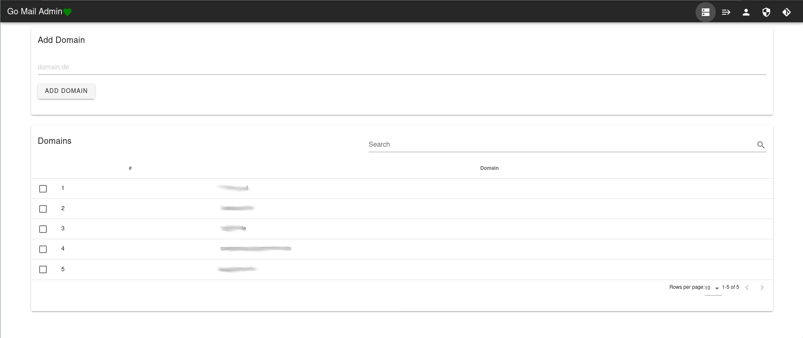

Still in development!!11einzelf!11!!

# Go-Mail-Admin
I want to admin my mailserver with a small webgui, I want a HTTP-API to manage some Domains from another Software, I don't want to install docker/java/php/apache/nginx/anything on the Server for that.

I want to learn go, I don't need validation (its a admin api, i have validation in other Software which uses this API)

# Installation
Download the last binary from the [Release Page](https://github.com/kekskurse/go-mail-admin/releases) to your ubuntu/debian Mailserver. 

Set the Enviroment-Varieables to configure the Go-Mail-Admin
```
export GOMAILADMIN_DB="vmail:vmailpassword@tcp(127.0.0.1:3306)/vmail"
export GOMAILADMIN_APIKEY=abc
export GOMAILADMIN_APISECRET=abc
```

After it you can start the Go-Mail-Admin with the following command
```
./go-mail-admin-with-gui-<VERSION>
```

# Usage
## Config
The script can be config with environment Variables. The following Settings are possible:

| Key | Required | Notice |
| --- | ---      | --- |
| GOMAILADMIN_DB | Yes | Database connection string like 'username:password@tcp(127.0.0.1:3306)/database' |
| GOMAILADMIN_APIKEY | No | API Key for HTTP-Basic-Auth (just use if APISECRET  is set too)  |
| GOMAILADMIN_APISECRET | No | API Secret for HTTP-Basic-Auth (just use if APIKEY is set too) |

## Run
Install or Compile the package, in both case you should have a go-mail-admin file which can be executed. To run the Admin-GUI call it

```
./go-mail-admin 
```

## API
### Domains
Domain Action can be triggert by a http call to /api/v1/domain. Parameter can be transmitted as JSON-Body

| Method | Notice |
| ---    | ---    |
| GET    | List all Domains |
| POST   | Create a new Domain, required Parameters: domain |
| DELETE | Delete a Domain, required Parameters: domain |

### Aliases
Alias Action can be triggert by a http call to /api/v1/alias. Parameter can be transmitted as JSON-Body

| Method | Notice |
| ---    | ---    |
| GET    | List all Aliases |
| POST   | Create a new Alias, required Parameters: source_username, source_domain, destination_username, destination_domain, enabled |
| DELETE | Delete a Domain, required Parameters: id |
| PUT    | Apdate a Alias, required Parameters: source_username, source_domain, destination_username, destination_domain, enabled, id |

### Account
Alias Action can be triggert by a http call to /api/v1/account. Parameter can be transmitted as JSON-Body

| Method | Notice |
| ---    | ---    |
| GET    | List all Accounts |
| POST   | Create a new Account, required Parameters: username, domain, password, quota, enabled, sendonly |
| DELETE | Delete a Account, required Parameters: id |
| PUT    | Apdate a Alias, required Parameters: quota, enabled, sendonly, id |

To update the Password make a http call to /api/v1/account/password with the Json-Body Parameter: id, password

### TLSpolicies
TLSPolicys can be changed by http call to /api/v1/tlspolicy

| Method | Notice |
| ---    | ---    |
| GET    | List all Policys |
| POST   | Create a new Policy, required Parameters: domain, policy, params |
| DELETE | Delete a Policy, required Parameters: id |
| PUT    | Apdate a Policy, required Parameters: domain, policy, params, id |

## Frontend
There is a VueJS Frontend to see and configure your Mailserver. You can access it by open http://yourmailserver.de:3001, if you set an API Key and Secret you need to performe a HTTP-Basic-Auth.

### Screenshots
*Domainliste*

*Aliases*

*Aliases Edit*


# Dev
## Project Sturctur
## Compile
Make sure you have all dependencies

```
go get github.com/go-sql-driver/mysql
go get github.com/go-chi/cors
go get gopkg.in/unrolled/render.v1
go get github.com/go-chi/chi
go get github.com/rakyll/statik
```

Create a public folder and add a frontend (or leave it empty)

Build the project
```
statik -src=./public
go build ./main.go
```