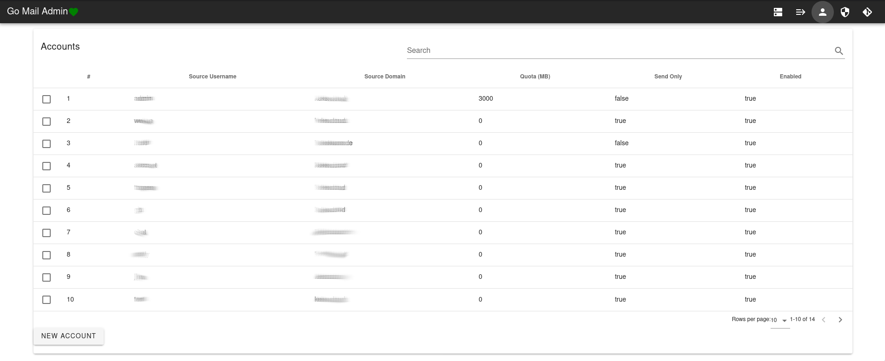

# Go-Mail-Admin
HTTP interface with a small GUI for a mailserver based on the [Tutorial "Own mail server based on Dovecot, Postfix, MySQL, Rspamd and Debian 9 Stretch"](https://thomas-leister.de/en/mailserver-debian-stretch/).
The project will connect to the MYSQL database to read and write the config. 

You just need to download one binary file to the server and run it, no other dependencies. However, you may want to add an nginx with SSL in front of it, or make it only available via VPN.

The HTTP interface doesn't validate your data, it's just another way to access your database.
# Installation

Download the last Debian Package from the [Release Page](https://github.com/kekskurse/go-mail-admin/releases) and install it.

See:  [Installation Doku](https://github.com/kekskurse/go-mail-admin/blob/master/docs/install.md).

# Usage
## Config
The script can be configured with environment variables. The following settings are possible:

| Key | Required | Default | Notice |
| --- | ---      | --- |   --- |
| GOMAILADMIN_DB | Yes | | Database connection string like 'username:password@tcp(127.0.0.1:3306)/database' |
| GOMAILADMIN_ADDRESS | No | ":" (all) | IP address to bind to |
| GOMAILADMIN_PORT | No | 3001 | Port at which is bound (default: 3001) |
| GOMAILADMIN_CATCHALL | No | Off | If set to "On" the catchall feature will be enabled, its necessary that source_username in alias can be NULL |
| GOMAILADMIN_REDIS_SERVER | No | localhost | Host for redis connection |
| GOMAILADMIN_REDIS_PORT | No | 6379 | Port for redis connection |
| GOMAILADMIN_AUTH_METHOD | Yes | None | How to authorisate, possible `None`, `Username`, `HTTPBasicAuth` [more info](https://github.com/kekskurse/go-mail-admin/blob/master/docs/auth.md) |
| GOMAILADMIN_AUTH_HTTPBasic_Username | No | None | If HTTPBasicAuth is enabled, the username |
| GOMAILADMIN_AUTH_HTTPBasic_Password | No | None | If HTTPBasicAuth is enabled, the password |
| GOMAILADMIN_AUTH_Username_Username | No | None | If Username auth is enabled, the username |
| GOMAILADMIN_AUTH_Username_Password | No | None | If Username auth is enabled, the password |
| GOMAILADMIN_CHECK_DNS_RECORDS | No | Off | If set to "On" it will check MX/SPF/DMARC Records which each call of the Domainlist, this is slow! |

## API

All features avalible in the Frontend are also in the API. The API current works with HTTP Basic Auth. [The documenation is avalible here](https://mrin9.github.io/OpenAPI-Viewer/#/load/https%3A%2F%2Fraw.githubusercontent.com%2Fkekskurse%2Fgo-mail-admin%2Fmaster%2Fdocs%2Fopenapi.json).

## Frontend
There is a VueJS frontend you can use to see and configure your mailserver. You can access it by opening http://yourmailserver.de:3001, if you set an API key and secret you need to performe a HTTP Basic Auth or login via webgui.

### Screenshots
*Dashboard*

*Domain List*

*Aliases*

*Aliases Edit*

*Accounts*

*Accounts Edit*

*TLS Policy*

*TLS Policy Edit*

